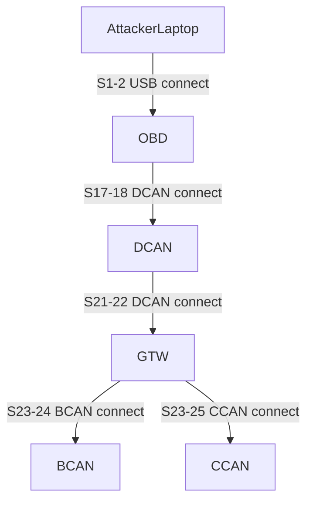

# Attack Path (Mermaid)

---

## Attack Path Explanation

**Hop 1: AttackerLaptop → OBD (steps 1–2)**  
Objective: Move from the external AttackerLaptop into the vehicle network via the OBD interface.  
Prerequisite: At step 1, the attacker discovers the OBD node and the `obd_dongle_token` credential on the USB port using the `AcquireOBDDongle` local vulnerability.  
Outcome: Using this credential, at step 2 the attacker connects over USB and infects OBD, earning score 2 and establishing an in-vehicle foothold.

**Hop 2: OBD → DCAN (steps 17–18)**  
Objective: Pivot from the OBD interface to the DCAN network.  
Prerequisite: At step 17, from OBD the attacker runs `EnableDCANAccess`, discovering the DCAN node and the `dcan_access` credential.  
Outcome: At step 18, OBD uses `dcan_access` over the DCAN protocol to infect DCAN, raising the score to 3 and expanding control deeper into the vehicle CAN backbone.

**Hop 3: DCAN → GTW (steps 21–22)**  
Objective: Compromise the central gateway (GTW) from the DCAN segment.  
Prerequisite: At step 21, the attacker on DCAN uses `ProvisionGatewayDCANAccess` to discover GTW and obtain a DCAN-port credential for GTW (`dcan_access`).  
Outcome: At step 22, DCAN connects to GTW via DCAN using this credential and infects GTW, increasing the score to 4 and gaining a central pivot point to other in-vehicle buses.

**Hop 4: GTW → BCAN (steps 23–24)**  
Objective: Access the BCAN bus from the compromised gateway.  
Prerequisite: At step 23, using `DumpBusAccessCreds` on GTW, the attacker discovers BCAN and obtains the `bcan_access` credential for the BCAN port.  
Outcome: At step 24, GTW connects to BCAN over the BCAN protocol and infects it, moving the score to 5 and extending control to another vehicle network segment.

**Hop 5: GTW → CCAN (steps 23–25)**  
Objective: Reach and compromise the CCAN bus from GTW.  
Prerequisite: Also at step 23, `DumpBusAccessCreds` reveals the CCAN node and the `ccan_access` credential for its CCAN port.  
Outcome: At step 25, GTW uses `ccan_access` over CCAN to infect CCAN, achieving the final episode score of 6; this is recorded as the terminal action in the log with the episode marked done.

---

## Evidence

| step | kind                   | action                                                                 | log (trimmed)                                                                                                                                                              |
|------|------------------------|------------------------------------------------------------------------|---------------------------------------------------------------------------------------------------------------------------------------------------------------------------|
| 1    | discovered_credential  | ["local_vulnerability", "AttackerLaptop", "AcquireOBDDongle"]         | discovered node: OBD. \| discovered credential: CachedCredential(node='OBD', port='USB', credential='obd_dongle_token'). \| Acquired OBD dongle token.                    |
| 1    | discovered_node        | ["local_vulnerability", "AttackerLaptop", "AcquireOBDDongle"]         | discovered node: OBD. \| discovered credential: CachedCredential(node='OBD', port='USB', credential='obd_dongle_token'). \| Acquired OBD dongle token.                    |
| 2    | infected_node          | ["connect", "AttackerLaptop", "OBD", "USB", "obd_dongle_token"]       | Infected node 'OBD' from 'AttackerLaptop' via USB with credential 'obd_dongle_token'.                                                                                     |
| 17   | discovered_credential  | ["local_vulnerability", "OBD", "EnableDCANAccess"]                    | discovered node: DCAN. \| discovered credential: CachedCredential(node='DCAN', port='DCAN', credential='dcan_access'). \| Enabled DCAN access (dcan_access) from OBD.    |
| 17   | discovered_node        | ["local_vulnerability", "OBD", "EnableDCANAccess"]                    | discovered node: DCAN. \| discovered credential: CachedCredential(node='DCAN', port='DCAN', credential='dcan_access'). \| Enabled DCAN access (dcan_access) from OBD.    |
| 18   | infected_node          | ["connect", "OBD", "DCAN", "DCAN", "dcan_access"]                     | Infected node 'DCAN' from 'OBD' via DCAN with credential 'dcan_access'.                                                                                                   |
| 21   | discovered_credential  | ["local_vulnerability", "DCAN", "ProvisionGatewayDCANAccess"]         | discovered node: GTW. \| discovered credential: CachedCredential(node='GTW', port='DCAN', credential='dcan_access'). \| GTW DCAN port now reachable with dcan_access...  |
| 21   | discovered_node        | ["local_vulnerability", "DCAN", "ProvisionGatewayDCANAccess"]         | discovered node: GTW. \| discovered credential: CachedCredential(node='GTW', port='DCAN', credential='dcan_access'). \| GTW DCAN port now reachable with dcan_access...  |
| 22   | infected_node          | ["connect", "DCAN", "GTW", "DCAN", "dcan_access"]                     | Infected node 'GTW' from 'DCAN' via DCAN with credential 'dcan_access'.                                                                                                   |
| 23   | discovered_credential  | ["local_vulnerability", "GTW", "DumpBusAccessCreds"]                  | discovered node: BCAN. \| discovered credential: CachedCredential(node='BCAN', port='BCAN', credential='bcan_access'). \| discovered node: CCAN. \| discovered cred...    |
| 23   | discovered_credential  | ["local_vulnerability", "GTW", "DumpBusAccessCreds"]                  | discovered node: BCAN. \| discovered credential: CachedCredential(node='BCAN', port='BCAN', credential='bcan_access'). \| discovered node: CCAN. \| discovered cred...    |
| 23   | discovered_credential  | ["local_vulnerability", "GTW", "DumpBusAccessCreds"]                  | discovered node: BCAN. \| discovered credential: CachedCredential(node='BCAN', port='BCAN', credential='bcan_access'). \| discovered node: CCAN. \| discovered cred...    |
| 23   | discovered_node        | ["local_vulnerability", "GTW", "DumpBusAccessCreds"]                  | discovered node: BCAN. \| discovered credential: CachedCredential(node='BCAN', port='BCAN', credential='bcan_access'). \| discovered node: CC