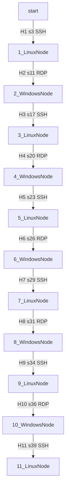

# Attack Path (Mermaid)

# Attack Path Explanation

### Hop 1: start → 1_LinuxNode (Hop 1, connect step 3)

Objective: Move from the initial position (`start`) to the first reachable Linux host (`1_LinuxNode`) using SSH.  
Prerequisite: At step 2, the attacker discovered both the node and its SSH credential `LinuxPassword!1` via `ScanExplorerRecentFiles` on `start` (hops table hop 1; discoveries.step 2).  
Outcome: At step 3, `1_LinuxNode` was successfully infected over SSH, giving the attacker a beachhead inside the environment and increasing the score to 2 (evidence step 3).

### Hop 2: 1_LinuxNode → 2_WindowsNode (Hop 2, connect step 11)

Objective: Pivot from the first Linux node to a Windows node (`2_WindowsNode`) via RDP.  
Prerequisite: `2_WindowsNode` was first referenced at step 4 and its RDP credential `WindowsPassword!2` was later obtained at step 10 using `CrackKeepPassX` on `1_LinuxNode` (hops table hop 2; discoveries.steps 4 and 10).  
Outcome: At step 11, the attacker used RDP with the recovered credential to infect `2_WindowsNode`, raising the cumulative score to 3 and expanding control to a Windows host (evidence step 11).

### Hop 3: 2_WindowsNode → 3_LinuxNode (Hop 3, connect step 17)

Objective: Continue lateral movement to `3_LinuxNode` using SSH from the compromised Windows node.  
Prerequisite: `3_LinuxNode` was discovered at step 12 (`ScanExplorerRecentFiles` on `2_WindowsNode`), and at step 16 the SSH credential `LinuxPassword!3` was obtained via `CrackKeepPass` (hops table hop 3; discoveries.steps 12 and 16).  
Outcome: At step 17, the attacker established an SSH connection and infected `3_LinuxNode`, increasing the score to 4 and restoring presence on a Linux system deeper in the chain (evidence step 17).

### Hop 4: 3_LinuxNode → 4_WindowsNode (Hop 4, connect step 20)

Objective: Pivot back into a Windows host (`4_WindowsNode`) over RDP from `3_LinuxNode`.  
Prerequisite: `4_WindowsNode` was identified via `ScanBashHistory` at step 18, and the RDP credential `WindowsPassword!4` was acquired at step 19 using `CrackKeepPassX` on `3_LinuxNode` (hops table hop 4; discoveries.steps 18 and 19).  
Outcome: At step 20, RDP was used to infect `4_WindowsNode`, raising the score to 5 and maintaining the alternating Linux/Windows compromise pattern (evidence step 20).

### Hop 5: 4_WindowsNode → 5_LinuxNode (Hop 5, connect step 23)

Objective: Advance to `5_LinuxNode` using SSH from the compromised Windows node.  
Prerequisite: `5_LinuxNode` was first referenced at step 21 and its SSH credential `LinuxPassword!5` was obtained at step 22 via `CrackKeepPass` on `4_WindowsNode` (hops table hop 5; discoveries.steps 21 and 22).  
Outcome: At step 23, SSH access led to infection of `5_LinuxNode`, pushing the score to 6 and extending the attacker’s foothold further along the Linux nodes (evidence step 23).

### Hop 6: 5_LinuxNode → 6_WindowsNode (Hop 6, connect step 26)

Objective: Pivot from `5_LinuxNode` to `6_WindowsNode` using RDP.  
Prerequisite: `6_WindowsNode` was discovered at step 24 by `ScanBashHistory`, and the RDP credential `WindowsPassword!6` was obtained at step 25 using `CrackKeepPassX` on `5_LinuxNode` (hops table hop 6; discoveries.steps 24 and 25).  
Outcome: At step 26, the attacker infected `6_WindowsNode` via RDP, increasing the score to 7 and maintaining continuous compromise across Windows hosts (evidence step 26).

### Hop 7: 6_WindowsNode → 7_LinuxNode (Hop 7, connect step 29)

Objective: Continue the chain to `7_LinuxNode` using SSH from `6_WindowsNode`.  
Prerequisite: `7_LinuxNode` was revealed at step 27 (`ScanExplorerRecentFiles`), and at step 28 the SSH credential `LinuxPassword!7` was obtained via `CrackKeepPass` on `6_WindowsNode` (hops table hop 7; discoveries.steps 27 and 28).  
Outcome: At step 29, `7_LinuxNode` was infected over SSH, raising the score to 8 and preserving the alternating OS pivot pattern (evidence step 29).

### Hop 8: 7_LinuxNode → 8_WindowsNode (Hop 8, connect step 31)

Objective: Move to another Windows host, `8_WindowsNode`, via RDP from `7_LinuxNode`.  
Prerequisite: `8_WindowsNode` and its RDP credential `WindowsPassword!8` were both associated with step 30, where `CrackKeepPassX` on `7_LinuxNode` yielded the needed information (hops table hop 8; discoveries.step 30).  
Outcome: At step 31, the attacker successfully infected `8_WindowsNode` using RDP, raising the score to 9 and extending control through yet another Windows system (evidence step 31).

### Hop 9: 8_WindowsNode → 9_LinuxNode (Hop 9, connect step 34)

Objective: Lateral movement from `8_WindowsNode` to `9_LinuxNode` via SSH.  
Prerequisite: `9_LinuxNode` was