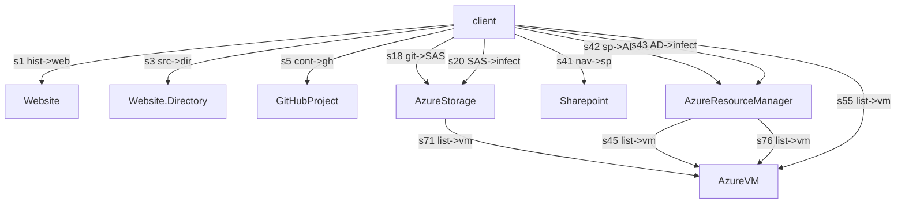

# CyberBattleSim Episode Report – toyctf

## Overview

- Environment: `toyctf`
- Total steps: 101  
- Final score: 3 (max 6)  
- Successful infections:  
  - `AzureStorage` via HTTPS using `SASTOKEN1` (step 20, score 2)  
  - `AzureResourceManager` via HTTPS using `ADPrincipalCreds` (step 43, score 3)  
- No flags captured (`flags`: empty)

---

## Attack Path (Mermaid)

---

## Attack Path Explanation

**Hop 1 – client → Website (step 1)**  
Objective: Identify an initial external asset of interest from the client.  
Prerequisite: Local access to the `client` browser history, used via `SearchEdgeHistory`.  
Outcome: At step 1, the attacker discovers the `Website`, establishing the first pivot point for further web-based reconnaissance.

**Hop 2 – client → Website.Directory (step 3)**  
Objective: Enumerate hidden or referenced paths on the website.  
Prerequisite: Network access from `client` to `Website` and the ability to view page source (`ScanPageSource`).  
Outcome: At step 3, the `Website.Directory` node is discovered, revealing additional content that later leads to Sharepoint.

**Hop 3 – client → GitHubProject (step 5)**  
Objective: Locate related source code or repositories that may contain sensitive information.  
Prerequisite: HTTP access from `client` to `Website` and the ability to scan page content (`ScanPageContent`).  
Outcome: At step 5, `GitHubProject` is discovered from the website content, enabling subsequent credential discovery in the git history.

**Hop 4 – client → AzureStorage (discovered/creds step 18, infected step 20)**  
Objective: Gain access to cloud storage by abusing leaked tokens.  
Prerequisite: Access to `GitHubProject` and the ability to run `CredScanGitHistory`, which at step 18 reveals the `AzureStorage` node and the `SASTOKEN1` credential over HTTPS.  
Outcome: Using `SASTOKEN1`, the attacker connects from `client` to `AzureStorage` via HTTPS at step 20, successfully infecting the `AzureStorage` node and gaining a scoring pivot (score 2).

**Hop 5 – client → Sharepoint (step 41)**  
Objective: Find additional enterprise resources that might expose further secrets.  
Prerequisite: Access to `Website.Directory` and the ability to navigate the directory (`NavigateWebDirectory`).  
Outcome: At step 41, `Sharepoint` is discovered from a checklist file, enabling the attacker to query Sharepoint content for credentials.

**Hop 6 – client → AzureResourceManager (creds/discovery step 42, infection step 43)**  
Objective: Escalate into Azure management APIs for broader cloud control.  
Prerequisite: Connection from `client` to `Sharepoint` and scanning of the parent directory (`ScanSharepointParentDirectory`), which at step 42 reveals the `AzureResourceManager` node and `ADPrincipalCreds`.  
Outcome: With `ADPrincipalCreds`, the attacker connects from `client` to `AzureResourceManager` via HTTPS at step 43, infecting it and gaining additional score (score 3).

**Hop 7 – AzureResourceManager / AzureStorage / client → AzureVM (steps 45, 55, 69, 71, 76)**  
Objective: Enumerate compute resources that could be future targets.  
Prerequisite: An infected `AzureResourceManager` (step 43) and access to `ListAzureResources` from various origins (`AzureResourceManager`, `client`, `AzureStorage`).  
Outcome: Across steps 45, 55, 69, 71, and 76, the `AzureVM` node is repeatedly discovered, providing information such as VM and public IP details, but no infection of `AzureVM` is recorded in this episode.

---

## Evidence

| step | kind                  | action                                                                                   | log (trimmed)                                                                                                                                                             |
|------|-----------------------|------------------------------------------------------------------------------------------|--------------------------------------------------------------------------------------------------------------------------------------------------------------------------|
| 20   | infected_node         | ["connect", "client", "AzureStorage", "HTTPS", "SASTOKEN1"]                             | Infected node 'AzureStorage' from 'client' via HTTPS with credential 'SASTOKEN1'.                                                                                        |
| 43   | infected_node         | ["connect", "client", "AzureResourceManager", "HTTPS", "ADPrincipalCreds"]              | Infected node 'AzureResourceManager' from 'client' via HTTPS with credential 'ADPrincipalCreds'.                                                                        |
| 18   | discovered_credential | ["remote_vulnerability", "client", "GitHubProject", "CredScanGitHistory"]               | discovered node: AzureStorage. \| discovered credential: ... 'AzureStorage', port='HTTPS', credential='SASTOKEN1' ... SAS token leaked in a reverted git commit.        |
| 26   | discovered_credential | ["remote_vulnerability", "client", "GitHubProject", "CredScanGitHistory"]               | discovered node: AzureStorage. \| discovered credential: ... 'AzureStorage', port='HTTPS', credential='SASTOKEN1' ... SAS token leaked in a reverted git commit.        |
| 42   | discovered_credential | ["remote_vulnerability", "client", "Sharepoint", "ScanSharepointParentDirectory"]       | discovered node: AzureResourceManager. \| discovered credential: ... 'AzureResourceManager', port='HTTPS', credential='ADPrincipalCreds' ... AD Service Principal creds.|
| 74   | discovered_credential | ["remote_vulnerability", "AzureResourceManager", "Sharepoint", "ScanSharepointParentDirectory"] | discovered node: AzureResourceManager. \| discovered credential: ... 'AzureResourceManager', port='HTTPS', credential='ADPrincipalCreds' ... AD Service Principal creds.|
| 75   | discovered_credential | ["remote_vulnerability", "AzureStorage", "Sharepoint", "ScanSharepointParentDirectory"] | discovered node: AzureResourceManager. \| discovered credential: ... 'AzureResourceManager', port='HTTPS', credential='ADPrincipalCreds' ... AD Service Principal creds.|
| 85   | discovered_credential | ["remote_vulnerability", "client", "Sharepoint", "ScanSharepointParentDirectory"]       | discovered node: AzureResourceManager. \| discovered credential: ... 'AzureResource